<div align="center">
  
</div>

<div align="center">
  
</div>

<div align="center">
  <a href="https://github.com/Priyal-Patel0810?tab=followers"></a>
  <a href="mailto:ADD_EMAIL_HERE"></a>
  <a href="ADD_LINKEDIN_URL_HERE"></a>
  
</div>

<br/>

<div align="center">
  
</div>

<table>
<tr>
<td width="54%" valign="top">

```yaml
name: Priyal Patel
role_target:
  - Cloud Engineer
  - Site Reliability Engineer
  - Infrastructure Engineer
cloud_focus:
  - AWS
  - GCP
  - Azure
builds_with:
  - Terraform
  - Docker
  - GitHub Actions
  - Jenkins
  - Linux
mission: Build scalable, secure, and reproducible delivery systems.
```

<p align="left">
  
  
  
  
  
  
</p>

</td>
<td width="46%" valign="top">


</td>
</tr>
</table>

<div align="center">
  
</div>

<div align="center">
  
</div>

<div align="center">
  
</div>

<br/>

<div align="center">
  
  
  
  
</div>

<br/>

<div align="center">
  
</div>

<table width="100%" border="0" cellspacing="10" cellpadding="0">
  <tr>
    <td width="50%" valign="top">
      <a href="https://github.com/Priyal-Patel0810/terraform-ci-cd">
        <h3 align="left">terraform-ci-cd</h3>
        <p align="left" style="font-size: 14px; color: #e5e7eb;">IaC workflow automation with Terraform and CI/CD validation.</p>
        
      </a>
    </td>
    <td width="50%" valign="top">
      <a href="https://github.com/Priyal-Patel0810/django-ecs-ec2-deployment-main">
        <h3 align="left">django-ecs-ec2-deployment-main</h3>
        <p align="left" style="font-size: 14px; color: #e5e7eb;">AWS container deployment using ECS, EC2, ECR, and Docker.</p>
        
      </a>
    </td>
  </tr>
  <tr>
    <td width="50%" valign="top">
      <a href="https://github.com/Priyal-Patel0810/Secure-Deployment-with-DevSecOps-CI-CD">
        <h3 align="left">Secure-Deployment-with-DevSecOps-CI-CD</h3>
        <p align="left" style="font-size: 14px; color: #e5e7eb;">DevSecOps-oriented delivery project with secure pipeline patterns.</p>
        
      </a>
    </td>
    <td width="50%" valign="top">
      <a href="https://github.com/Priyal-Patel0810/GCP">
        <h3 align="left">GCP / Azure-voting-app</h3>
        <p align="left" style="font-size: 14px; color: #e5e7eb;">Multi-cloud learning projects covering GCP builds and Azure container workloads.</p>
        
      </a>
    </td>
  </tr>
</table>

<br/>

<div align="center">
  
  
  
  
</div>

<div align="center">
  
</div>

<div align="center">
  
</div>

<div align="center">

```text
Automate repetitive work.
Design for recovery.
Prefer reproducible systems.
Ship with observability in mind.
Treat reliability as a feature.
```

</div>

<div align="center">
  
</div>

<div align="center">
  <a href="ADD_LINKEDIN_URL_HERE">
    
  </a>
  <a href="mailto:ADD_EMAIL_HERE">
    
  </a>
</div>

<br/>

<div align="center">
  
</div>
